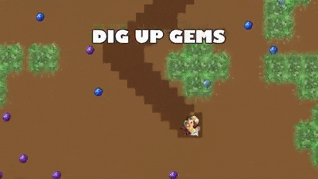
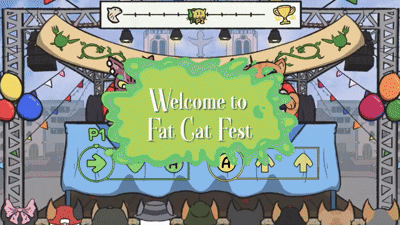

# Emiliano Guerra

Whether it's through software or film, i'm <i>always</i> trying to stir something in people's minds.

## What I've done

    <table>
        <tr>
            <td style="padding:10px">
                

                <a href="https://gugulplex.itch.io/cherenkov"> Cherenkov 
                </a> 
                
  
                    General design, Gameplay,   
                    Environment scripting, enemy A.I  
                    and (most of the) music.
            </td>
            <td style="padding:10px">
                
            </td>
        </tr>
        <tr>
            <td style="padding:10px">
                

                <a href="https://theyippies.itch.io/gem-frenzy"> Gem Frenzy
                </a>
                
  
                    Environment scripting, Gameplay and UI.  
            </td>
            <td style="padding:10px">
                
            </td>
        </tr>
        <tr>
            <td style="padding:10px">
                

                <a href="https://store.steampowered.com/app/3259080/The_Fat_Cat_Fest/"> The Fat Cat Fest
                </a>
                
  
                    UI, enemy A.I. and French localization.  
            </td>
            <td style="padding:10px">
                
            </td>
        </tr>
    </table>

## Game Engines I've used

 
As you might suspect, i'm big on artistic expression, however i'm also a huge math nerd so you bet i can hold my own
when faced with low-level software development or 3D math. 😉
 

## My cup of tea

## What i'm looking for at the moment
I'm looking for internships in videogame development companies.  
If that doesn't work out, i'm also looking for a semester abroad in Game Development-oriented schools or degrees.
<!--
**soetgdeznsgk/soetgdeznsgk** is a ✨ _special_ ✨ repository because its `README.md` (this file) appears on your GitHub profile.

Here are some ideas to get you started:

- 🔭 I’m currently working on ...
- 🌱 I’m currently learning ...
- 👯 I’m looking to collaborate on ...
- 🤔 I’m looking for help with ...
- 💬 Ask me about ...
- 📫 How to reach me: ...
- 😄 Pronouns: ...
- ⚡ Fun fact: ...
-->
